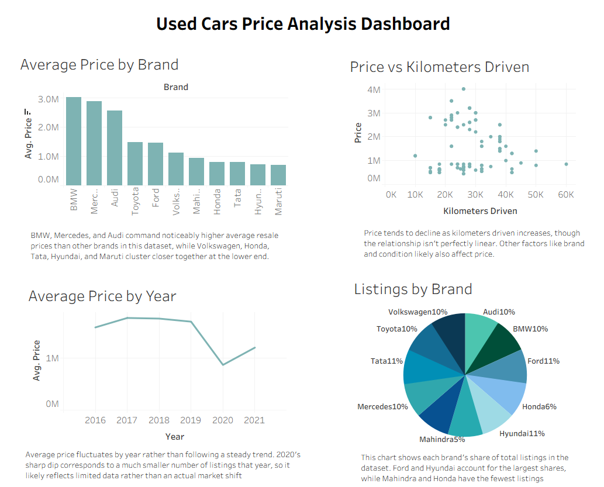

# Used Car Price Prediction

A machine learning model that predicts used car prices based on vehicle features, built using linear regression.

## Overview
Pricing a used car fairly depends on many factors like mileage, age, brand, condition, and more. 
This project builds a predictive model to estimate used car prices, applying linear regression to uncover which features drive price the most.

## 📊 Interactive Dashboard

An interactive Tableau dashboard exploring pricing trends, brand comparisons, 
and mileage impact on price for this dataset.

🔗 [View Live Dashboard on Tableau Public](https://public.tableau.com/shared/CX8HQ8XJR?:display_count=n&:origin=viz_share_link)

## Dataset
- Used cars dataset containing vehicle features such as make, model, year, mileage, fuel type, transmission, and other specifications, along with the sale price.

## Approach
1. **Data Cleaning:** Handled missing values, fixed inconsistent data types
2. **Exploratory Data Analysis:** Examined feature distributions and correlations with price
3. **Feature Engineering:** Used **LabelEncoder** to convert categorical (non-numerical) features into numerical form, applied **StandardScaler** to normalize feature ranges
4. **Model Training:** Fit a linear regression model to predict car price
5. **Evaluation:** Assessed model performance using R² score and MSE

## Results
- **R² Score (train set):** 0.88
- **R² Score (test set):** 0.75
- **MSE (test set):** 0.26

The model explains about 75% of the variance in used car prices on unseen data. The gap between train R² (0.88) and test R² (0.75) suggests some overfitting.
The model fits the training data noticeably better than new data, which is worth addressing in future iterations. 

## Tools Used
Python, pandas, NumPy, scikit-learn, matplotlib/seaborn, Jupyter Notebook

## How to Run
1. Clone this repository
2. Install dependencies: `pip install pandas numpy scikit-learn matplotlib seaborn`
3. Open and run `LinearRegression_UsedCarPrice.ipynb` in Jupyter Notebook

## Files
- `LinearRegression_UsedCarPrice.ipynb` main analysis and model

## Future Improvements
- Apply regularization (Ridge/Lasso) to reduce overfitting
- Try tree-based models (Random Forest, XGBoost) which often handle non-linear relationships in pricing data better
- Perform feature selection to remove less informative features contributing to overfitting
